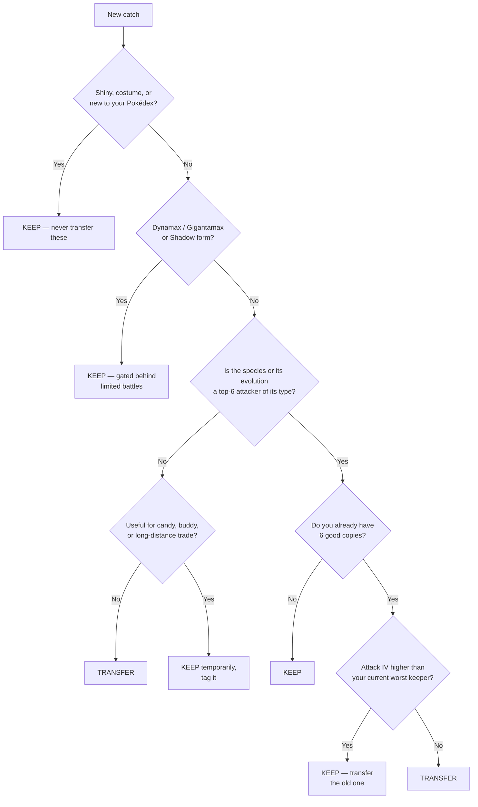
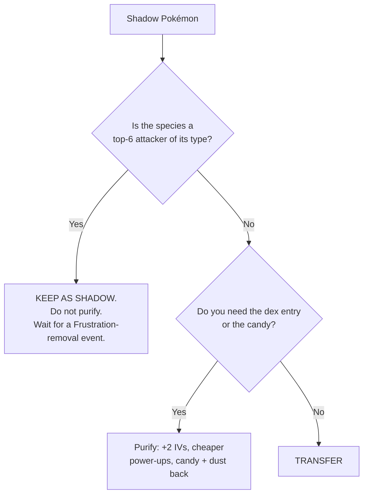

# 2. Keep or Transfer? — The Decision System

This is the file you will use most. It answers one question: **for a PvE-focused
player, is this Pokémon worth a storage slot?**

Transferring gives you **1 Candy** (and a ~1-in-15 chance of **1 Candy XL**), and
frees a slot. It is permanent.

---

## 2.1 The 30-second decision tree



---

## 2.2 The permanent-keep list

**Never transfer these, regardless of IVs:**

| Category | Why |
|---|---|
| **Shinies** | Irreplaceable, and shiny odds are brutal. |
| **Costume / event forms** | Often permanently unobtainable afterwards. |
| **Anything new to your Pokédex** | Dex entries are progression. |
| **Dynamax / Gigantamax Pokémon** | Only obtainable from Max Battles at Power Spots. |
| **Legendaries and Mythicals** | Even a bad-IV one is Mega/Primal fodder or candy insurance. |
| **Lucky Pokémon** | 12/12/12 floor and **half Stardust cost** to power up. |
| **Shadow Pokémon of any raid-relevant species** | 1.2× damage; the best PvE forms in the game. |
| **Community Day / event-move Pokémon** | The exclusive move usually needs an Elite TM later. |
| **Anything currently in a Gym** | You cannot transfer it anyway, and it is earning you coins. |
| **Your Buddy** | Same. |

---

## 2.3 The "Rule of Six"

A raid team is **six slots**. You will relobby with the same six.

> **For any given attacker species, you need six good copies — and the seventh is
> worth almost nothing.**

Once you have six Machamp you are happy with, every further Machamp is candy.
This one rule will clear more storage than anything else.

Nuance: keep a couple of spares of species you might want in *two* different roles
(e.g. a Metagross team for raids plus a spare for a Rocket lineup), and keep spares
of anything whose candy is hard to farm.

---

## 2.4 IV thresholds for a PvE player

Because IVs are worth ~5–8% (see [Fundamentals §1.5](01-fundamentals.md#15-how-much-do-ivs-actually-matter)),
the bar is much lower than the internet suggests.

| Attack IV | Verdict |
|---|---|
| **15** | Ideal. Keep. |
| **13–14** | Functionally identical to 15. Keep and invest without guilt. |
| **10–12** | Fine as a team filler. Keep if you don't have six better. |
| **0–9** | Only keep if it is a species you cannot easily re-catch. |

**Ignore Defense and HP IVs entirely for raids.** They are worth a rounding error.
(They matter in PvP, which you have said you don't play — so ignore star ratings,
which weight all three equally and will mislead you.)

> The in-game star/appraisal rating is a **PvP-flavoured** average. A 3-star
> `15/2/4` is a better raid attacker than a 4-star `12/15/15`. Check the actual
> Attack bar, not the stars.

---

## 2.5 Species that are worth keeping even at bad IVs

Keep these because they are *hard to obtain*, not because they are good:

- **Anything with limited/regional availability** — regionals, unreleased-form
  Pokémon, event-locked spawns.
- **Anything whose candy is expensive** — Legendary lines, Ultra Beasts,
  low-spawn-rate species. A spare is candy insurance.
- **Long-distance trade candidates** — a Pokémon caught **100 km+** from your
  location guarantees **1 Candy XL** on trade, and every trade has a chance to be
  Lucky. Tag these and hold them for trade partners.
- **Purification targets** — Shadow Pokémon you don't want as Shadows still give
  candy, Stardust and a **+2 IV** boost on purification.

---

## 2.6 The transfer-fodder search

One search string that shows **only Pokémon not worth keeping**. Paste it into the
search bar in your Pokémon storage, then long-press to multi-select and transfer.

### The string

```
!4*&!3*&!shiny&!legendary&!mythical&!ultra beast&!shadow&!purified&!lucky&!costume&!dynamax&!gigantamax&!favorite&!defender&!buddy&!evolvenew&!tradeevolve
```

Every clause is an exclusion, so what survives is: **mediocre IVs, ordinary form,
not special to you, and nothing lost by transferring it.**

| Clause | Protects |
|---|---|
| `!4*&!3*` | Anything above ~80% IVs (star bands: 3★ = 37–44, 4★ = 45 total IVs) |
| `!shiny` `!costume` | Irreplaceable forms |
| `!legendary&!mythical&!ultra beast` | Rare tiers |
| `!shadow&!purified` | Rocket-sourced; Shadows are your best attackers |
| `!lucky` | Half-price power-ups, 12/12/12 floor |
| `!dynamax&!gigantamax` | Max Battle roster — very hard to replace |
| `!favorite&!defender&!buddy` | Flagged, in a Gym, or walking with you |
| `!evolvenew` | Evolving it would give you a **new dex entry** |
| `!tradeevolve` | Has a free trade evolution pending |

### ⚠️ Why it has no commas in it

Pokémon GO supports `&` (AND), `!` (NOT) and `,` (OR) — **but not parentheses**, and
published sources genuinely disagree on how `&` and `,` bind when mixed. Some
document `a,b&c` as `(a OR b) AND c`; others as `a OR (b AND c)`.

Those two parses differ enormously here. Under the second one, a trailing `1*,2*`
would mean *"(everything excluded… AND 1★) **OR** any 2★ at all"* — and every 2★
shiny and legendary you own would land in a list you are about to mass-transfer.

**So this string is built from `&` and `!` only.** `!4*&!3*` selects the same
Pokémon as `1*,2*,0*` and cannot be mis-parsed. Avoid mixing the two operators in
any search where a wrong answer costs you a Pokémon.

### Make it scale: add `!keep`

The string above is blind to **species**, and for a PvE player species matters far
more than IVs — a 4★ Pidgey is junk, while a 1★ Machop is worth keeping until you
have six Machamp. A pure-IV filter gets this exactly backwards.

Fix it with one tag. Tag everything on your PvE roster `keep` (see
[§2.7](#27-use-tags--they-are-the-real-storage-system)), then append `&!keep`:

```
!4*&!3*&!shiny&!legendary&!mythical&!ultra beast&!shadow&!purified&!lucky&!costume&!dynamax&!gigantamax&!favorite&!defender&!buddy&!evolvenew&!tradeevolve&!keep
```

One tag replaces a hundred `&!machop&!machoke&!machamp…` clauses, and it stays
correct as your roster changes. **This is the version to actually use.**

### Short version

If you are typing rather than pasting, this catches most of it:

```
!4*&!3*&!shiny&!legendary&!mythical&!shadow&!lucky&!favorite&!evolvenew&!keep
```

### Rule-of-Six overflow culls

The searches above never surface your 7th–20th Machop, because star rating doesn't
know you already have six. Do that per species, one line at a time:

```
machop,machoke,machamp
```

Commas alone are unambiguous — the precedence problem only appears when you mix them
with `&`. Sort by **CP descending**, keep your best six, transfer the tail.

Worth running for every species in your
[workhorse roster](04-raids-and-counters.md#workhorse-tier-accessible-farmable-candy)
once a month.

### Before you hit transfer

1. **Eyeball the list.** Always. No search string is a substitute for a glance.
2. **Check the count** against what you expect. A surprisingly large number means a
   clause didn't apply — stop and re-read the string.
3. **Transfers are permanent.** Favorite or tag anything you are unsure about
   instead; it'll be excluded next time.

### Other useful searches

| Search | Finds |
|---|---|
| `age0` | Caught today — review before they get lost in storage. |
| `4*` / `3*` / `2*` / `1*` / `0*` | By appraisal star rating (total IVs: 0★ 0–22, 1★ 23–29, 2★ 30–36, 3★ 37–44, 4★ 45). |
| `shiny` `lucky` `shadow` `purified` `costume` | Special forms. |
| `dynamax` / `gigantamax` | Your Max Battle roster. |
| `legendary` `mythical` `ultra beast` | Rare tiers. |
| `traded` / `hatched` / `raid` / `research` | By origin. |
| `distance5000-` | Caught 5,000 km+ away — Candy XL trade fodder. |
| `evolve` | Can evolve right now with the candy you have. |
| `evolvenew` | Evolving would give you a **new dex entry**. |
| `tradeevolve` | Has a free trade evolution available. |
| `buddy0`–`buddy5` | By buddy/friendship level. |
| `@1flying` | Has a Flying-type **fast** move. (`@2` = charged, `@3` = 2nd charged.) |
| `@dragon breath` | Has that specific move. |
| `defender` | Currently in a Gym (cannot transfer). |
| `favorite` | Flagged — cannot be transferred. |
| `year2016` | Caught in a given year — your oldest, most sentimental mons. |
| `cp1500-2500` | CP range. |
| `hp10-` | HP 10 or above. |

> Term support changes between releases. The authoritative list is in-game:
> **Pokémon storage → search bar → the `?` / "Search Help" link.** If a clause in the
> long string above does nothing, it is silently ignored rather than erroring — which
> is exactly why you eyeball the results.

---

## 2.7 Use tags — they are the real storage system

Tags are far more useful than nicknames. A workable PvE tag set:

| Tag | Meaning |
|---|---|
| **`keep`** | **The umbrella tag. Anything on this list is off-limits to the transfer-fodder search above.** Apply it to everything below as well. |
| `RAID` | On an active raid team. Never transfer. |
| `INVEST` | Next in line for Stardust. |
| `XL` | Worth taking to Level 50 eventually. |
| `TRADE` | Long-distance / Lucky trade fodder. |
| `ETM` | Waiting on an Elite TM or a legacy-move event. |
| `MAX` | Part of a Max Battle lineup. |
| `PURIFY?` | Shadow I haven't decided about. |
| `SAFE` | Sentimental. Do not touch. |

Tag on catch, clean up weekly, and you will never agonise over an individual
Pokémon again. You can search by tag, and tags survive evolution.

> **The `keep` tag is what makes the transfer-fodder search safe.** A search string
> can only know about IVs and forms; it cannot know that you are farming Machop for a
> Machamp team. The tag carries that knowledge, so `&!keep` turns a blunt IV filter
> into one that respects your actual plans.

---

## 2.8 What to do *before* you transfer

1. **Check `evolvenew`** — free dex entries you were about to throw away.
2. **Check for a Community Day move** — check the move list against
   [current legacy moves](https://leekduck.com/) before deleting an old evolution.
3. **Consider the Gym coin** — a spare high-HP Pokémon (Blissey, Snorlax, Chansey)
   is worth keeping purely to sit in Gyms for your **50 coins/day**.
4. **Mass transfer, don't one-at-a-time.** Long-press to multi-select.

---

## 2.9 Special case: is this Shadow worth keeping?



Full detail in [Shadow, Rocket & Purification](07-shadow-and-rocket.md).

---

**Next:** [3. Power Up, Evolve, or Add Moves? →](03-investment.md)
