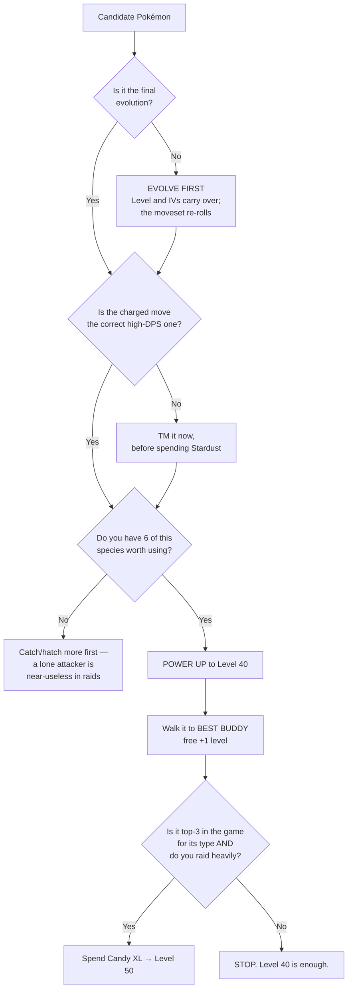

# 3. Power Up, Evolve, or Add Moves?

Stardust is your real currency. Candy XL is your real bottleneck. This file is about
spending both without regret.

---

## 3.1 The order of operations

Do these in order. Doing them out of order wastes resources.

---

## 3.2 Evolving

**Rules:**

- **Evolution preserves level and IVs.** It does *not* preserve moves — the moveset
  is re-rolled on evolution.
- **Always evolve before powering up.** Not because power-up is lost (it isn't), but
  because you need to see the final moveset before committing Stardust, and you may
  discover the evolved form rolled a bad charged move.
- **Evolve during the event window** for Community Day / event-exclusive moves.
  These are usually gone afterwards and cost an **Elite TM** to recover. If an event
  says "evolve during the event to get *X*", that window is the cheapest that move
  will ever be.
- **Stack XP.** Save 30–60 evolutions, pop a **Lucky Egg** (2× XP), and mass-evolve.
  With the level cap now at **80**, XP efficiency matters more than it used to.

**When *not* to evolve:** if the pre-evolution is a better Gym defender, or if you're
saving candy for a better-IV copy of the same species.

---

## 3.3 Powering up

### Level 40 is the sweet spot

| Target | Cost from L1 | Worth it for |
|---|---|---|
| **Level 40** | ~200,000 Stardust, ~250 Candy | **Every raid attacker you actually use.** |
| **Level 50** | +250,000 Stardust, **+296 Candy XL** | Only your top 3–6 Pokémon in the entire game. |

Going 40 → 50 buys **+6.3% to each stat** for more Stardust than getting to 40 cost
in the first place. For almost everyone, **six Level 40 attackers beat three Level 50
attackers**, because raid damage is a team-wide sum and you relobby with all six.

### Candy XL costs differ by form

| Form | Candy XL for L40 → L50 |
|---|---|
| **Purified** | **272** (cheapest) |
| Normal | **296** |
| **Shadow** | **360** (most expensive) |

Shadow costs ~22% more XL than Purified for the same species — but the 1.2× damage
multiplier is worth far more than the 6.3% you get from L50. **Prioritise a Level 40
Shadow over a Level 50 normal.**

### Best Buddy is a free level

Walking a Pokémon to **Best Buddy** gives a permanent **+1 level equivalent** in
battle. That is ~1.3% of the ~6.3% you'd get from an entire L40→L50 climb, for zero
Stardust.

**Do this before you spend a single Candy XL.** Set your top attackers as buddy on
rotation while you walk anyway.

### Lucky Pokémon cost half

A **Lucky** Pokémon costs **50% less Stardust** to power up, and has a 12/12/12 IV
floor. A Lucky copy of a good attacker is the cheapest Level 40 you will ever build —
prioritise them hard.

---

## 3.4 Second charged move — usually skip it for PvE

This is the biggest money-saver in this guide.

> **In a raid you only ever use your best charged move.** A second charged move adds
> nothing to your raid DPS. It is a **PvP feature**, and you don't play PvP.

Unlocking a second move costs Stardust *and* Candy — often 75,000+ dust and 75+ candy
for a Legendary. That is a third of a Level 40 build, spent on nothing.

**The narrow exceptions where a second charged move helps PvE:**

| Situation | Why |
|---|---|
| **Team GO Rocket battles** | Rocket bosses shield your charged moves. A cheap second move lets you burn shields with the cheap one and land the big one after. Genuinely useful. |
| **Gym clearing** | Coverage against varied defenders saves time. |
| **Mega Evolutions at Super Max level** | Eligible Megas get a **third** charged attack while Mega Evolved (see [Mega Evolution](06-mega-evolution.md)), and Mega Level scales its base power. |
| **A Pokémon with two genuinely different-typed strong moves** | e.g. a mon you want as both your Ice and your Ground answer. Rare; usually two separate copies is cheaper. |

**Verdict:** unlock second moves on **2–3 dedicated Rocket-battle Pokémon** and
nothing else, until you have Stardust to spare.

---

## 3.5 TMs and Elite TMs

| Item | Use it for |
|---|---|
| **Fast TM** | Rerolling a bad fast move. Cheap and plentiful — use freely. |
| **Charged TM** | Rerolling a bad charged move. Use freely on non-Legendaries. |
| **Elite Fast/Charged TM** | **Only** for legacy and Community Day moves you cannot otherwise get. |

**Never burn an Elite TM on a move a regular TM can roll.** Elite TMs are the
scarcest item in the game. Before using one, check the Pokémon's full possible move
pool on a resource like [Pokémon GO Hub](https://pokemongohub.net/) or
[Leek Duck](https://leekduck.com/) — if the move you want is in the normal pool, a
regular TM will get there eventually.

**Legendary caution:** Charged TMs on Legendaries with three or more charged moves
can take many attempts. Consider whether the move you have is "good enough" (within
~10% DPS) before burning ten TMs on a marginal upgrade.

---

## 3.6 Where to spend Stardust, in priority order

1. **Powering your first six of a needed type to Level 40.** Coverage beats depth.
   Six types covered at L40 beats one type covered at L50.
2. **Second charged moves on 2–3 Rocket specialists.** One-off cost, high convenience.
3. **Filling type gaps.** Look at your roster and find the type where your best
   attacker is weakest. That is where the next 100,000 dust goes.
4. **Level 50 on your single best all-round attacker.** A Mega-capable or
   Shadow Legendary that you bring to nearly every raid.
5. Everything else.

**Stardust income to prioritise:**
- **Star Piece (+50% dust) during Community Day / Spotlight Hour** — the single
  biggest dust multiplier available to a casual player.
- **Increasing friendship levels** — huge one-off dust payouts at Great/Ultra/Best.
- **Daily catch and spin streaks** — free, guaranteed.
- **Field Research** with Stardust rewards, banked and cashed in under a Star Piece.

---

## 3.7 Quick answers

**"Should I power this up?"**
Only if (a) it's a top attacker of its type, (b) it has the right moveset, and (c)
you have or will have six of them. Otherwise, wait.

**"Should I evolve this?"**
Yes, if it's the final evolution of a useful line, or if `evolvenew` says it's a new
dex entry, or if there's an event move on offer. Otherwise hold the candy.

**"Should I give it a second move?"**
For PvE, almost always **no**. Exception: Rocket battle specialists.

**"Level 40 or Level 50?"**
Level 40, unless it's in your personal top 3–6 Pokémon and you raid weekly.

**"Should I use my Elite TM?"**
Only for a legacy/Community Day move. Never for a move in the normal pool.

---

**Next:** [4. Raids & Counters →](04-raids-and-counters.md)
