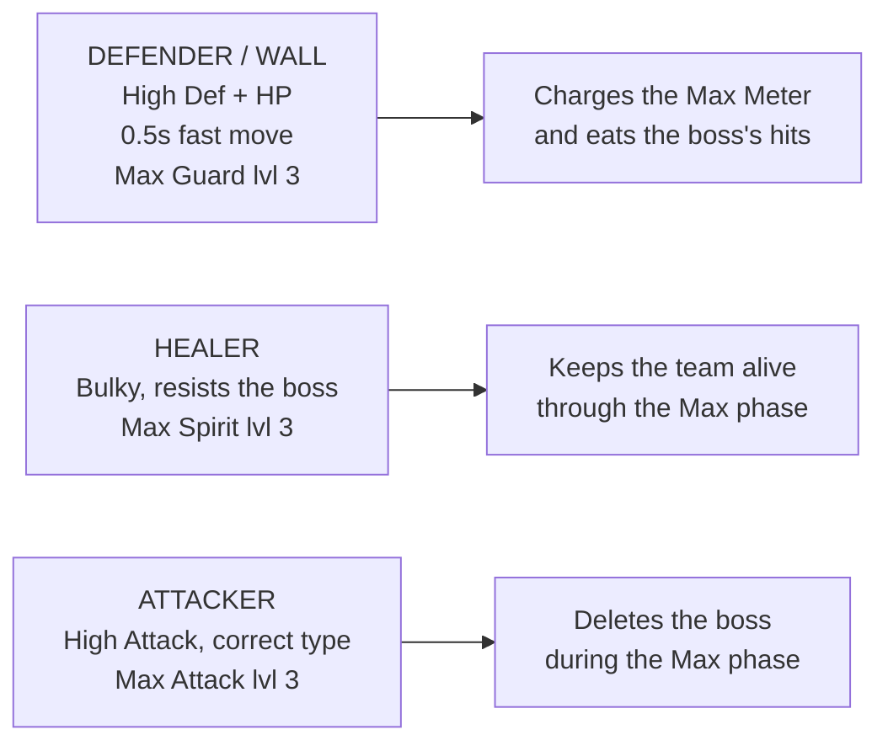

# 5. Max Battles (Dynamax & Gigantamax)

Max Battles are a **completely separate PvE system** from raids. Different currency,
different venues, different roster, different rules. If you are PvE-focused, this is
the biggest content stream added since raids themselves.

---

## 5.1 The basics

| Thing | Detail |
|---|---|
| **Where** | **Power Spots**, not Gyms. They appear on the map as glowing spots. |
| **Currency** | **Max Particles (MP)** — collected by walking near Power Spots. |
| **MP cap** | **1,500** held at once. |
| **MP daily earn** | **800/day** from standard sources, resetting at **5:00 a.m. local time**. |
| **Party size** | Up to **4 trainers**, 3 Max Pokémon each. |
| **How to get Dynamax Pokémon** | **Only** by winning Max Battles. They cannot be caught in the wild. |
| **Daily limit** | **10 sets** per day (up from 5), for **50 battles**. |

**Dynamax state survives evolution** — so a Dynamax Charmander evolved into a
Dynamax Charizard keeps its Dynamax capability. This matters for investment: catch
the low-tier base form, evolve it, and you have the good one.

### Tiers

| Tier | You catch |
|---|---|
| **1★–3★** | Standard **Dynamax** Pokémon |
| **5★** | **Legendary Dynamax** Pokémon (the Kanto birds, etc.) |
| **6★** | **Gigantamax** Pokémon — the strongest, with unique G-Max moves |

As of September 2026 there are around **51 species** available as Dynamax or
Gigantamax across the tiers.

---

## 5.2 How a Max Battle actually works

The battle has two phases that alternate:

1. **Normal phase** — you fight with regular fast and charged attacks. Using **fast
   attacks charges the Max Meter.**
2. **Max phase** — once the meter fills, your Pokémon Dynamaxes and gets three turns
   of **Max Moves**, which are far more powerful and have team-wide effects.

**The key insight:** the Max phase is where all your damage comes from, and the
normal phase exists to *charge into it and survive*. This is why the roster you need
is completely different from a raid roster.

### The three Max Moves

| Move | Effect | Unlocked |
|---|---|---|
| **Max Attack** | Big typed damage | **Unlocked at level 1 by default** |
| **Max Guard** | Shields the whole team | Locked — must be purchased |
| **Max Spirit** | Heals the whole team | Locked — must be purchased |

Each can be levelled **1 → 3** by spending **Max Particles + Candy + Candy XL**.

---

## 5.3 The three roles — build one of each

This is the most important thing to understand. A Max Battle team is **not** three
attackers.

### Defender / Wall
- **High Defense and HP**, resists the boss's attack types.
- **Critically: a 0.5-second fast move.** Fast-move *count*, not damage, charges the
  Max Meter — so short-duration fast moves charge it fastest. This is the single most
  under-appreciated stat in Max Battles.
- Invest in **Max Guard**.

### Healer
- Bulky enough to survive the Max phase.
- Invest in **Max Spirit**. A level 3 Max Spirit can undo an entire boss rotation.

### Attacker
- Correct type against the boss, highest possible Attack.
- Invest in **Max Attack** and nothing else.

> **Where to spend Max Particles:** get **one** solid defender, **one** solid healer,
> and **one attacker per common boss type**. Do not spread particles across a wide
> bench — Max Move levels are expensive and a level 1 Max Attack is a fraction of a
> level 3.

---

## 5.4 Keep-or-transfer rules for Dynamax Pokémon

**Never transfer a Dynamax or Gigantamax Pokémon** until you have a settled roster.
They are gated behind a daily-limited, in-person activity — they are far harder to
replace than a wild catch.

Once you have a working roster:

| Situation | Verdict |
|---|---|
| Gigantamax form | **Always keep.** 6★ battles are rare and hard. |
| Legendary Dynamax | **Always keep.** |
| Your best defender / healer / attacker per type | **Keep, invest.** |
| 4th+ copy of a Dynamax species you already invested in | Transfer for candy, **unless** the Attack IV is a clear upgrade — you can't easily re-roll these. |
| Dynamax base-form with a bad IV, species you have covered | Transfer. |

Search `dynamax` and `gigantamax` in storage to audit your roster.

---

## 5.5 Max Mondays and practical tips

- **Max Mondays** is a weekly one-hour event where a featured Pokémon appears in
  **all** Power Spots, and there are **extra Power Spots active on Mondays**.
  Bonuses have included **1 Rare Candy XL** for completing in-person Max Battles.
  If you can only do Max Battles once a week, do them on Monday.
- **Max Battles are in-person.** You must physically be at a Power Spot. There is no
  remote equivalent — plan around this.
- **Collect MP passively.** Walking near Power Spots accrues particles. If you pass
  Power Spots on a commute or walk, you will hit the 800/day cap without effort.
- **Gigantamax (6★) battles need a real group** — 4 trainers with properly
  invested, correctly-typed teams. Coordinate; do not walk in solo.
- **The boss's type tells you the whole plan.** Pick a defender that resists it, a
  healer that survives it, and an attacker that beats it.

---

**Next:** [6. Mega Evolution →](06-mega-evolution.md)
