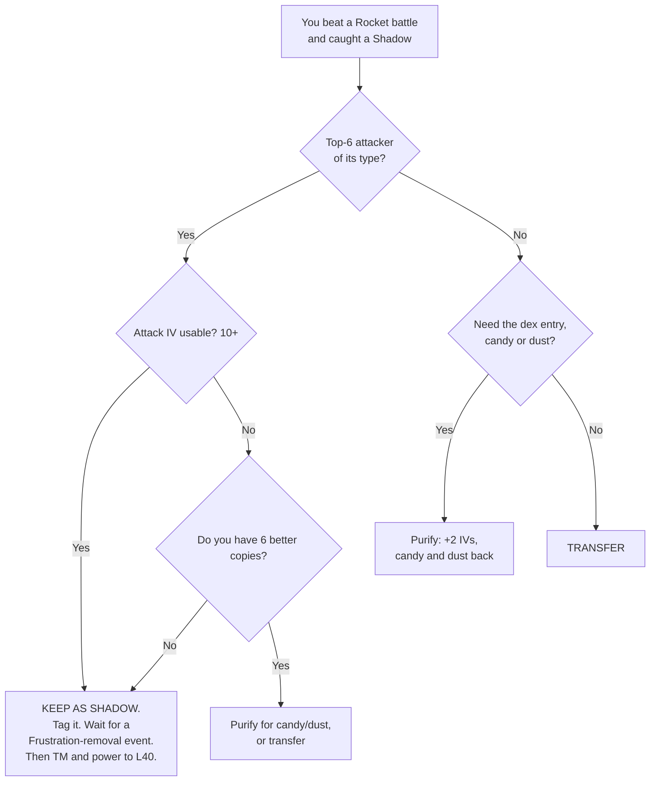

# 7. Shadow Pokémon, Team GO Rocket & Purification

Shadow Pokémon are the best PvE attackers in the game. This file is about getting
them and — crucially — **not ruining them.**

---

## 7.1 The Shadow multiplier

| Effect | Value |
|---|---|
| Damage **dealt** | **×1.2** |
| Damage **taken** | **×1.2** |

In raids you are attacking, not defending, and you relobby freely when you faint.
**The downside barely matters; the upside is enormous.**

> A **Shadow at Level 35 out-damages a normal at Level 50** of the same species.
> The 1.2× multiplier is worth roughly three times more than the entire Level 40 → 50
> climb.

This is why "Shadow Mewtwo" tops every raid-investment list, and why the correct
answer to *"should I power up my Shadow or my normal copy?"* is almost always
**the Shadow**.

---

## 7.2 ⚠️ Do NOT purify a good attacker

Purifying a Shadow Pokémon:

| Gain | Loss |
|---|---|
| **+2 to each IV** (capped at 15) | **The 1.2× damage multiplier — permanently** |
| Cheaper power-ups (**272** Candy XL vs **360** for Shadow) | The Shadow aesthetic/status |
| Removes **Frustration** immediately | |
| Refunds some Candy and Stardust | |

The +2 IVs are worth **~1% damage**. The Shadow multiplier is worth **20%**.

**Purification is a trap for PvE players.** Purify only when:
- You need the dex entry or the Candy and the species has no raid value, **or**
- It's a species you'll never raid with and you want the cheaper power-up, **or**
- You want a cheap, high-IV Pokémon for a Gym or a collection goal.

**Never purify:** any Shadow of a top-6 attacker of its type. Ever.

---

## 7.3 The Frustration problem

Shadow Pokémon are caught with the charged move **Frustration**, which is terrible
and **cannot be removed with a normal Charged TM.**

**Your options:**

1. **Wait for a Frustration-removal event.** Several times a year (often Team GO
   Rocket takeover events, or around the winter holidays), an event lets you use a
   **Charged TM to remove Frustration**. This is the intended and cheapest route.
2. **Use an Elite Charged TM.** Works any time, but Elite TMs are precious.
   Justified only for a genuinely top-tier Shadow you want *now*.

**Practical rule:** catch and stockpile good Shadows, **hold them un-purified**, and
mass-TM them the moment a Frustration-removal event runs. Tag them `ETM` or
`FRUSTRATION` so you can find them instantly.

> **Do not power up a Shadow that still has Frustration.** Wait until you've removed
> it and confirmed the replacement charged move is the right one, then invest.

---

## 7.4 Getting Shadow Pokémon

| Source | What you get |
|---|---|
| **Grunt battles** | Common Shadows. Grunts announce their type ("Don't tangle with…"), so you know the counters before you start. |
| **Rocket Leaders** (Cliff, Arlo, Sierra) | Better Shadows. Need a **Rocket Radar**, assembled from **6 Mysterious Components** dropped by grunts. |
| **Giovanni** | **Shadow Legendaries.** Needs a **Super Rocket Radar** from a Special Research line. Rotates every few months — check what he's holding before you burn the radar. |
| **Shadow Raids** | Shadow Legendaries and pseudo-Legendaries. Harder than normal raids (the boss is enraged), but **remote-joinable since May 2025.** |
| **Rocket Balloons** | Appear on the map periodically through the day — free grunt/leader encounters without walking. |

---

## 7.5 Fighting Rocket efficiently

Rocket battles are **shield-based**, unlike raids: the enemy blocks your charged
moves. This is the one PvE context where a **second charged move genuinely helps.**

**The technique:**
1. Build 2–3 dedicated Rocket Pokémon with **two charged moves** — one **cheap**
   (low energy) and one **expensive** (high damage).
2. Burn the boss's shields with the cheap move.
3. Land the expensive move once shields are gone.

**Other tips:**
- **Grunts telegraph their type.** Their quote tells you what they'll use — swap in
  the right counter before starting.
- **Leaders and Giovanni get two shields each.** Plan for exactly two cheap-move
  throws before the real damage.
- **Switch-timing exploit:** switching Pokémon gives you a window where the opponent
  pauses. Advanced, but it can carry hard fights.
- **You get Stardust and Mysterious Components from every grunt.** Even losing
  fights are worth starting for the components.
- **Bring a bulky Pokémon, not just DPS.** Unlike raids, you cannot relobby.

---

## 7.6 Decision summary

---

**Next:** [8. Resources & Daily Routine →](08-resources-and-routine.md)
